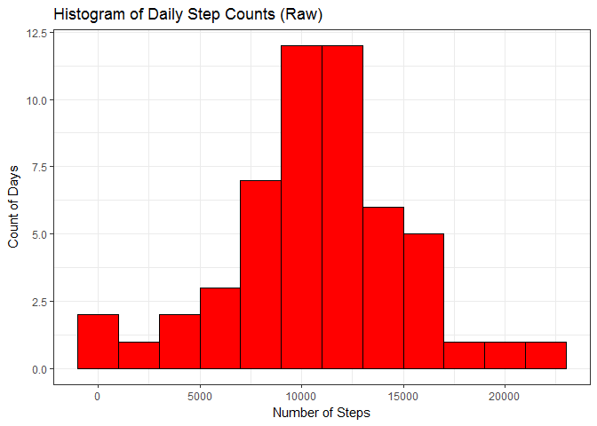
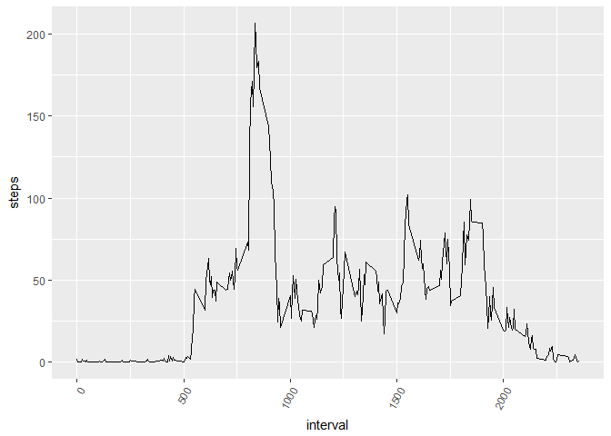
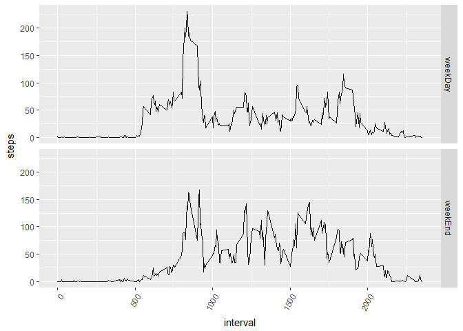

# Analysis of Actvity Monitoring
Peter Geers  
24 november 2016  
# Intro
If you load the PA1_template.html file into your browser  thole story can easily be read in the webbrowser (inclduing the graphs)

If you read the PA1_template.md files you have to go to the folder PA1_template_files anmd then figure-latex where the Graphics reside.


```r
# knitr::opts_chunk$set(echo=TRUE,keep_md=TRUE)
# knitr to .md file
# knitr("PA1_template.Rmd", output = NULL) 
require(knitr)
```

```
## Loading required package: knitr
```

```r
require(ggplot2)
```

```
## Loading required package: ggplot2
```

```r
require(timeDate)
```

```
## Loading required package: timeDate
```


## Code for reading in the dataset and/or processing the data

Here the data is loaded in te dataFrame activities. Data is only loaded if it does not exists. Following with the summary and a plot


```r
if (!exists("activities")) {
    activities <- read.csv("./activity.csv")
}
```

## What is mean total number of steps taken per day?

For this part of the assignment, you can ignore the missing values in the dataset. Calculate the total number of steps taken per day. If you do not understand the difference between a histogram and a barplot, research the difference between them. Make a histogram of the total number of steps taken each day. 
The following bar shows the sum of the steps per interval for each day.


```r
## Histogram of the total number of steps taken each day
daySteps <- aggregate(activities$steps, list(date=activities$date),sum)
summary(daySteps)
```

```
##          date          x        
##  2012-10-01: 1   Min.   :   41  
##  2012-10-02: 1   1st Qu.: 8841  
##  2012-10-03: 1   Median :10765  
##  2012-10-04: 1   Mean   :10766  
##  2012-10-05: 1   3rd Qu.:13294  
##  2012-10-06: 1   Max.   :21194  
##  (Other)   :55   NA's   :8
```

```r
ggplot(daySteps) +
    aes(x=x) +
    geom_histogram(binwidth=2000, fill="red", color="black") + 
    labs(x="Number of Steps", y="Count of Days", 
         title="Histogram of Daily Step Counts (Raw)") +
    theme_bw()
```

```
## Warning: Removed 8 rows containing non-finite values (stat_bin).
```

<!-- -->

```r
meanNumber <- mean(daySteps$x, na.rm = TRUE)
medianNumber <- median(daySteps$x, na.rm = TRUE)
```
Calculate and report the mean and median of the total number of steps taken per day.
The mean equals to 1.0766189\times 10^{4} and the median equals to 10765.

## What is the average daily activity pattern?

- Make a time series plot (i.e. type = "l") of the 5-minute interval (x-axis) and the average number of steps taken, averaged across all days (y-axis)

```r
intervalSteps <- aggregate(activities$steps, list(interval=activities$interval), mean, na.rm=TRUE)
mean(intervalSteps$x, na.rm = TRUE)
```

```
## [1] 37.3826
```

```r
median(intervalSteps$x, na.rm = TRUE)
```

```
## [1] 34.11321
```

```r
summary(intervalSteps)
```

```
##     interval            x          
##  Min.   :   0.0   Min.   :  0.000  
##  1st Qu.: 588.8   1st Qu.:  2.486  
##  Median :1177.5   Median : 34.113  
##  Mean   :1177.5   Mean   : 37.383  
##  3rd Qu.:1766.2   3rd Qu.: 52.835  
##  Max.   :2355.0   Max.   :206.170
```

```r
ggplot(intervalSteps, aes(x=interval, y=x),type ="l", ylim=2500) + geom_line(stat="identity") + theme(axis.text.x = element_text(angle=60, hjust=1))+ ylab("steps")
```

<!-- -->

- Which 5-minute interval, on average across all the days in the dataset, contains the maximum number of steps?


```r
maxIntervalSteps <- max(intervalSteps$x)
maxInterval <- intervalSteps[intervalSteps$x == maxIntervalSteps,]
maxInterval <- maxInterval$interval
```

- The maximum number of steps 206.1698113 is in interval between 835 and 840

## Imputing missing values.

Note that there are a number of days/intervals where there are missing values (coded as NA). The presence of missing days may introduce bias into some calculations or summaries of the data.

1. Calculate and report the total number of missing values in the dataset (i.e. the total number of rows with NAs)

```r
numberOfNa <- nrow(activities) - nrow(na.omit(activities))
```
-- The number of missing values is 2304.

2. Devise a strategy for filling in all of the missing values in the dataset. The strategy does not need to be sophisticated. For example, you could use the mean/median for that day, or the mean for that 5-minute interval, etc.

-- We will replace the NA values with the average interval values as calculated in intervalSteps. 

3. Create a new dataset that is equal to the original dataset but with the missing data filled in.


```r
newActivities <- merge(activities, intervalSteps, by.x = "interval", by.y = "interval")
newActivities$steps[is.na(newActivities$steps)] <- as.integer(newActivities$x[is.na(newActivities$steps)])
```

4. Make a histogram of the total number of steps taken each day and Calculate and report the mean and median total number of steps taken per day. Do these values differ from the estimates from the first part of the assignment? What is the impact of imputing missing data on the estimates of the total daily number of steps?


```r
## Histogram of the total number of steps taken each day
newDaySteps <- aggregate(newActivities$steps, list(date=newActivities$date),sum)

ggplot(daySteps) +
    aes(x=x) +
    geom_histogram(binwidth=2000, fill="red", color="black") + 
    labs(x="Number of Steps", y="Count of Days", 
         title="Histogram of Daily Step Counts (Raw)") +
    theme_bw()
```

```
## Warning: Removed 8 rows containing non-finite values (stat_bin).
```

<!-- -->

```r
newMeanNumber <- mean(newDaySteps$x, na.rm = TRUE)
newMedianNumber <- median(newDaySteps$x, na.rm = TRUE)
diffMeanNumber <- newMeanNumber - meanNumber
diffMedianNumber <- newMedianNumber - medianNumber
```

- The mean equals to 1.074977\times 10^{4} initial value was 1.0766189\times 10^{4}. The variance is **-16.4181874**.

- The median equals to 10641 initial value was 10765. The variance is **-124**.

## Are there differences in activity patterns between weekdays and weekends?

For this part the weekdays() function may be of some help here. Use the dataset with the filled-in missing values for this part.

Create a new factor variable in the dataset with two levels – “weekday” and “weekend” indicating whether a given date is a weekday or weekend day.


```r
newActivities$dayType <- ifelse(isWeekday(newActivities$date, wday=1:5) == TRUE, "weekDay","weekEnd")

str(newActivities)
```

```
## 'data.frame':	17568 obs. of  5 variables:
##  $ interval: int  0 0 0 0 0 0 0 0 0 0 ...
##  $ steps   : int  1 0 0 0 0 0 0 0 0 0 ...
##  $ date    : Factor w/ 61 levels "2012-10-01","2012-10-02",..: 1 54 28 37 55 46 20 47 38 56 ...
##  $ x       : num  1.72 1.72 1.72 1.72 1.72 ...
##  $ dayType : chr  "weekDay" "weekDay" "weekEnd" "weekDay" ...
```

Make a panel plot containing a time series plot (i.e. type = "l") of the 5-minute interval (x-axis) and the average number of steps taken, averaged across all weekday days or weekend days (y-axis). See the README file in the GitHub repository to see an example of what this plot should look like using simulated data.


```r
newIntervalSteps <- aggregate(steps ~ interval + dayType, data = newActivities, mean)

ggplot(newIntervalSteps, aes(x=interval, y=steps),type ="l", ylim=2500) + geom_line(stat="identity") + theme(axis.text.x = element_text(angle=60, hjust=1))+ ylab("steps") + facet_grid(dayType ~ .)
```

<!-- -->

This should be a complete answer to the questions?
